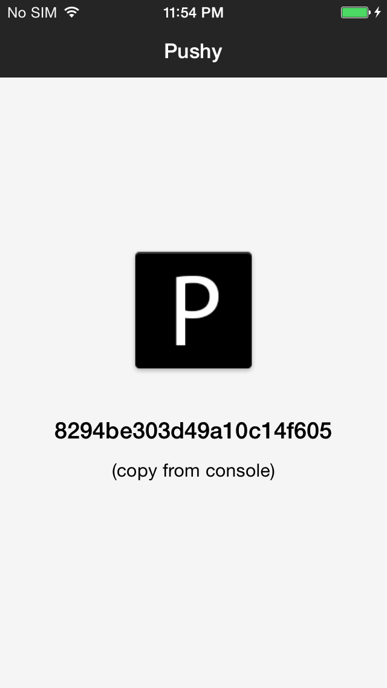
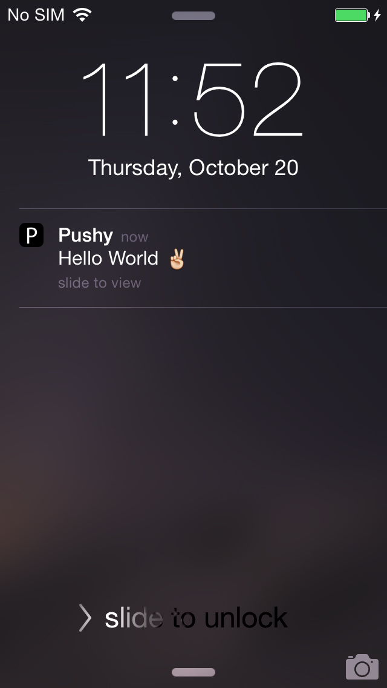

# pushy-demo-ios

A demo of the [Pushy iOS SDK](https://pushy.me/docs/ios/get-sdk) integrated into a sample iOS app.

> [Pushy](https://pushy.me/) is the most reliable push notification gateway, perfect for real-time, mission-critical applications.

This app registers your device to receive push notifications and assigns it a unique token, which you can copy and paste into the [demo page](https://pushy.me/docs/resources/demo) to send yourself a test push notification.

## Screenshots

 

## Get Started

* Clone the repository locally
* Run `pod install` (ensure [CocoaPods](https://cocoapods.org/) is installed)
* Open `PushyDemo.xcworkspace` using Xcode 8 or newer
* Build and run the demo application on a physical iOS device
* Copy the device token from the Xcode console and paste it into the [demo page](https://pushy.me/docs/resources/demo) to send yourself a test notification

## More Information

* [Pushy](https://pushy.me/)
* [Pricing](https://pushy.me/pricing)
* [Documentation](https://pushy.me/docs)

## License

[Apache 2.0](LICENSE)
